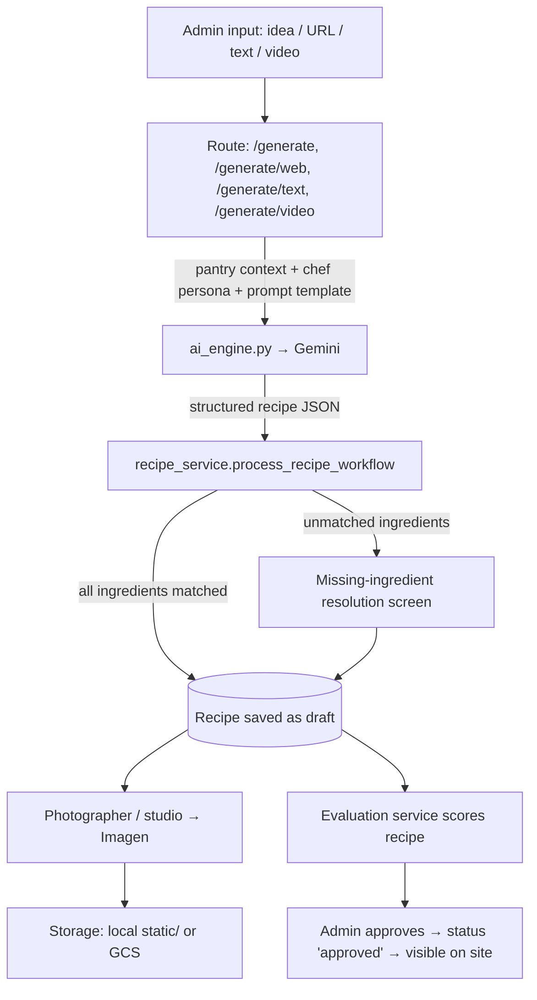

# Technical Documentation ⚙️

**Audience**: Developers, maintainers.

The Lazy Chef is a Flask monolith with server-rendered Jinja2 templates (Tailwind CSS), a service layer for AI and business logic, and a relational database. AI output is always validated against the curated ingredient database before it is stored ("human in the loop").

## 1. Architecture Overview

| Layer | Where | Notes |
|---|---|---|
| Web / routes | `app.py`, `routes/` | `app.py` holds most public and core routes; admin areas are Flask blueprints in `routes/` |
| AI (text) | `ai_engine.py` | All recipe generation / extraction calls to Gemini |
| Services | `services/` | Recipe workflow, pantry, nutrition, evaluation, photography, scraping, TikTok, storage, podcasts |
| Media hub | `media_hub/` | Renders social images (Playwright), podcasts (Text-to-Speech) and videos from recipes |
| Data | `database/models.py` | SQLAlchemy models; Alembic migrations in `migrations/` |
| Prompts | `data/prompts/` | Jinja2 prompt templates, assembled at runtime |
| Vocabularies | `data/constraints/`, `data/post_processing/` | Fixed lists (diets, cuisines, meal types, …) that constrain AI output |
| Personas | `data/agents/` | Chef and photographer personas |
| Helpers | `utils/` | Prompt loading, image helpers, decorators (`admin_required`), AI error messages |

### Infrastructure

| Concern | Local | Production |
|---|---|---|
| Database | SQLite `kitchen.db` (`DB_BACKEND=local`) | Cloud SQL Postgres via the Cloud SQL connector (`DB_BACKEND=cloudsql`) |
| File storage | `static/` (`STORAGE_BACKEND=local`) | Google Cloud Storage bucket (`STORAGE_BACKEND=gcs`) |
| Server | `python app.py` (port 8000) | Gunicorn on Cloud Run (1 worker, 8 threads) |

### AI models

| Purpose | Model | Where |
|---|---|---|
| Recipe generation & extraction | `gemini-2.5-flash`, `gemini-flash-latest` | `ai_engine.py` |
| Recipe / ingredient evaluation | `gemini-flash-latest`, `gemini-2.x-flash` | `services/evaluation_service.py`, `services/ingredient_evaluation_service.py` |
| Visual prompts & image analysis | `gemini-2.0-flash` | `services/photographer_service.py` |
| Dish & ingredient images | `imagen-4.0-generate-001`, `imagen-4.0-fast-generate-001` | `services/photographer_service.py`, `services/vertex_image_service.py` |
| TikTok ingestion, style center | `gemini-2.5-flash` | `services/tiktok_ingestion_service.py`, `routes/admin_style_center.py` |
| Media hub scripts | `gemini-2.0-flash` | `media_hub/orchestrator.py` |

## 2. Recipe Generation Flow



Other diagrams: [RECIPE_GENERATION_FLOWCHART.md](RECIPE_GENERATION_FLOWCHART.md), [RECIPE_GENERATION_SEQUENCE.md](RECIPE_GENERATION_SEQUENCE.md), [RECIPE_GENERATION_SWIMLANE.md](RECIPE_GENERATION_SWIMLANE.md).

### Prompts
Prompts are not hardcoded. `utils/prompt_manager.load_prompt` renders templates from `data/prompts/`, combining:
1.  **Role** from the chef persona (`data/agents/chefs.json`, or the `Chef` table).
2.  **Context**: a slim list of database ingredients, so the AI only uses ingredients that exist.
3.  **Rules**: shared partials (`data/prompts/partials/`) with the controlled vocabularies and a strict JSON output format.

See [PROMPT_ENGINEERING_GUIDE.md](PROMPT_ENGINEERING_GUIDE.md).

### AI errors
Gemini errors are mapped to user-safe messages by `utils/ai_errors.friendly_ai_error` (billing, rate limit, bad key, outage). The raw error is printed to the server log.

## 3. Data Model (main tables)

| Model | Purpose |
|---|---|
| `Recipe`, `Instruction`, `RecipeIngredient` | Recipe, its steps, and gram-weighted ingredients (supports components and sub-recipes). `status`: `draft` → `approved` |
| `Ingredient` | Curated ingredient with nutrition, synonyms, images, `embedding` (pgvector) and `status` |
| `RecipeEvaluation`, `IngredientEvaluation` | AI quality scores |
| `Chef` | Chef personas |
| `User`, `UserRecipeInteraction`, `UserQueue` | Accounts (`is_admin`), favorites / made / feedback, personal queue |
| `RecipeCollection`, `CollectionItem` | Curated collections |
| `Resource` | Blog-style articles |
| `SocialMediaPost`, `SequenceTemplate`, `TikTokSource` | Media hub and TikTok ingestion |
| `VisualStyleGuide`, `StyleSandboxRun`, `StyleSandboxPreset`, `ConceptVisual` | Photo style center |

Schema changes: `flask db migrate -m "..."`, review the file in `migrations/versions/`, and commit it. Production runs `flask db upgrade` as part of each deploy.

## 4. Access Control

*   `@login_required` (Flask-Login) for user features (favorites, feedback, queue).
*   `@login_required @admin_required` (`utils/decorators.py`) for everything that writes shared data or calls paid AI APIs.
*   `tests/test_smoke.py` enforces this: every POST/PUT/PATCH/DELETE route must reject anonymous users, and every `@admin_required` route must return 403 for non-admins. Intentionally public write routes are listed in `PUBLIC_WRITE_ENDPOINTS`.

## 5. Configuration

| Variable | Required | Purpose |
|---|---|---|
| `GOOGLE_API_KEY` | yes | Gemini / Imagen API key |
| `SECRET_KEY` | prod | Signs session cookies. Required on Cloud Run; random per process locally if unset |
| `DB_BACKEND` | no | `local` (default) or `cloudsql` |
| `DATABASE_URL` | no | Override the local SQLite URL (used by tests: `sqlite://`) |
| `INSTANCE_CONNECTION_NAME`, `DB_USER`, `DB_PASS`, `DB_NAME` | cloudsql | Cloud SQL connection |
| `STORAGE_BACKEND` | no | `local` (default) or `gcs` |
| `GCS_BUCKET_NAME` | gcs | Asset bucket |
| `GOOGLE_CLOUD_PROJECT`, `GOOGLE_CLOUD_LOCATION` | no | Vertex AI settings |
| `FLASK_DEBUG` | no | `1` enables debug mode for `python app.py` |

## 6. Testing

```bash
python -m pytest tests/
```

*   `tests/test_smoke.py`: page loads and route protection (in-memory SQLite, dummy keys).
*   `tests/test_ai_errors.py`: AI error message mapping.
*   `tests/test_ai_normalization.py`: recipe component normalization (mocked Gemini).

CI (`.github/workflows/deploy.yaml`) runs flake8 syntax checks and `pytest tests/` on every pull request.

Ad-hoc debug and maintenance scripts live in `scripts/`, `scripts/debug/` and `scripts/maintenance/`; run them from the repo root, e.g. `python -m scripts.debug.verify_setup`.
