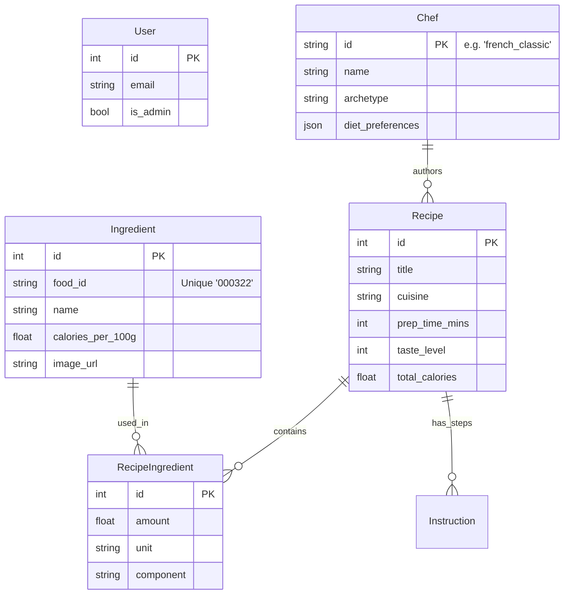

# Visual Architecture Documentation 📊

This document provides visual diagrams of "The Lazy Chef" architecture, data flow, and deployment pipelines. These diagrams are rendered automatically by GitHub using Mermaid.js.

## 1. System Architecture (Bird's Eye View)
A high-level overview of how the Flask application sits between the user, Google Cloud services, and external data sources.

```mermaid
graph TD
    User["📱 User / Web Browser"] -->|HTTPS| CDN["🌍 Google Cloud Run Load Balancer"]
    CDN -->|Request| App["🍳 Flask App (The Lazy Chef)"]

    subgraph "Google Cloud Platform"
        App -->|Read/Write| DB[("🗄️ Cloud SQL / PostgreSQL")]
        App -->|Store Images| GCS["☁️ Cloud Storage (Buckets)"]
        
        subgraph "AI Services"
            App -->|Generate Recipe| Gemini["🧠 Gemini 1.5 Flash (AI Engine)"]
            App -->|Generate Photos| Imagen["🎨 Imagen 3 (Vertex AI)"]
        end
    end

    subgraph "External Sources"
        App -->|Scrape| Blog["🌐 Recipe Blogs"]
        App -->|Download| Social["🎬 TikTok/Instagram"]
    end
```

## 2. Core Application Loop

```mermaid
sequenceDiagram
    actor User
    participant Flask as 🍳 Flask Controller
    participant Pantry as 🥫 Pantry Service
    participant Gemini as 🧠 AI Engine
    participant DB as 🗄️ Database
    participant Vertex as 🎨 Visual Engine

    User->>Flask: POST /generate (Query: "Spicy Chicken")
    Flask->>Pantry: get_slim_pantry_context()
    Pantry-->>Flask: Returns List of Ingredients
    
    Flask->>Gemini: generate_recipe_ai(Query + Pantry Context)
    Note right of Gemini: Validates ingredients &<br/>creates structure
    Gemini-->>Flask: JSON Recipe Data
    
    Flask->>DB: Save Recipe & Ingredients
    
    par Async Image Generation
        Flask->>Vertex: generate_visual_prompt(Recipe Title)
        Vertex-->>Flask: Returns Image URL
        Flask->>DB: Update Recipe with Image URL
    end
    
    Flask-->>User: Redirect to /recipe/{id}
```

## 3. Data Model

## 4. Deployment Pipeline (CI/CD)

```mermaid
graph LR
    Dev["💻 Developer"] -->|git push| GitHub["📂 GitHub Repo"]
    
    subgraph "GitHub Actions CI/CD"
        GitHub -->|Trigger| Test["🧪 Lint & Test"]
        Test -->|Success| Auth["🔐 WIF Authentication"]
        Auth -->|Build| Docker["🐳 Build Container"]
        Docker -->|Push| AR["📦 Artifact Registry"]
        AR -->|Deploy| Run["🚀 Cloud Run"]
    end
    
    subgraph "Post-Deploy Actions"
        Run -->|Run Job| Mig["🗃️ Database Migration"]
        Run -->|Update| DNS["🌐 Update DNS/Traffic"]
    end
```

