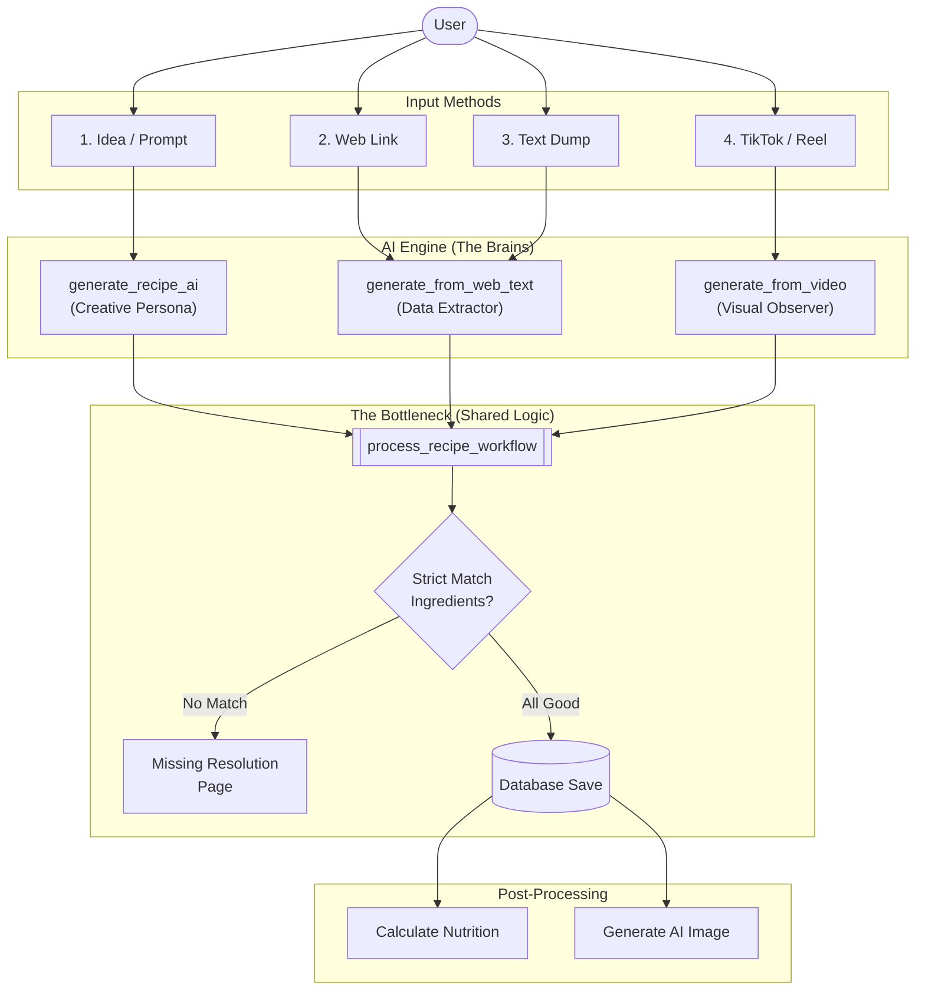

# Recipe Generation Architecture (Flowchart)

```mermaid
graph TD
    %% Define the Inputs
    User([User])

    subgraph "Input Methods"
        Idea[1. Idea / Prompt]
        Web[2. Web Link]
        Text[3. Text Dump]
        Video[4. TikTok / Reel]
    end

    %% Define the AI Processing
    subgraph "AI Engine (The Brains)"
        GenChef["generate_recipe_ai<br/>(Creative Persona)"]
        GenExtract["generate_from_web_text<br/>(Data Extractor)"]
        GenVision["generate_from_video<br/>(Visual Observer)"]
    end

    %% The Unified Service
    subgraph "The Bottleneck (Shared Logic)"
        Service[[process_recipe_workflow]]
        Fuzzy{"Strict Match<br/>Ingredients?"}
        Missing["Missing Resolution<br/>Page"]
        Save[(Database Save)]
    end

    %% Post Processing
    subgraph "Post-Processing"
        Nutrition[Calculate Nutrition]
        Image[Generate AI Image]
    end

    %% Connections
    User --> Idea
    User --> Web
    User --> Text
    User --> Video

    Idea --> GenChef
    Web --> GenExtract
    Text --> GenExtract
    Video --> GenVision

    GenChef --> Service
    GenExtract --> Service
    GenVision --> Service

    Service --> Fuzzy
    Fuzzy -- No Match --> Missing
    Fuzzy -- All Good --> Save
    Save --> Nutrition
    Save --> Image
```
