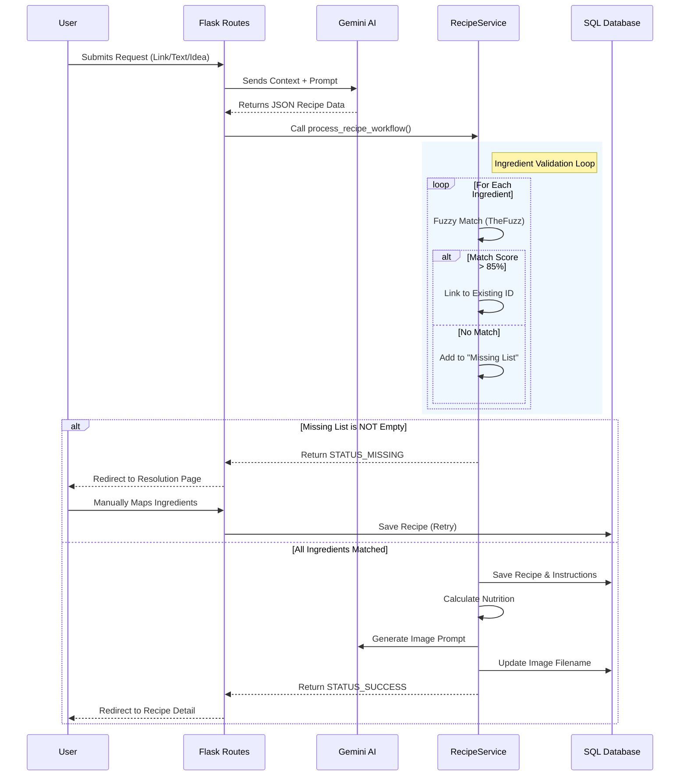

# Recipe Generation Logic (Sequence)

```mermaid
sequenceDiagram
    participant User
    participant App as Flask Routes
    participant AI as Gemini AI
    participant Service as RecipeService
    participant DB as SQL Database

    User->>App: Submits Request (Link/Text/Idea)
    App->>AI: Sends Context + Prompt
    AI-->>App: Returns JSON Recipe Data

    App->>Service: Call process_recipe_workflow()

    rect rgb(240, 248, 255)
        note right of Service: Ingredient Validation Loop
        loop For Each Ingredient
            Service->>Service: Fuzzy Match (TheFuzz)
            alt Match Score > 85%
                Service->>Service: Link to Existing ID
            else No Match
                Service->>Service: Add to "Missing List"
            end
        end
    end

    alt Missing List is NOT Empty
        Service-->>App: Return STATUS_MISSING
        App-->>User: Redirect to Resolution Page
        User->>App: Manually Maps Ingredients
        App->>DB: Save Recipe (Retry)
    else All Ingredients Matched
        Service->>DB: Save Recipe & Instructions
        Service->>Service: Calculate Nutrition
        Service->>AI: Generate Image Prompt
        Service->>DB: Update Image Filename
        Service-->>App: Return STATUS_SUCCESS
        App-->>User: Redirect to Recipe Detail
    end
```
