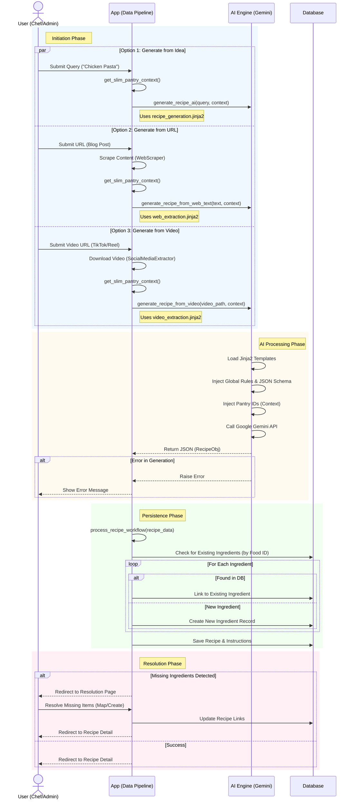

```mermaid
sequenceDiagram
    actor U as User (Chef/Admin)
    participant A as App (Data Pipeline)
    participant AI as AI Engine (Gemini)
    participant DB as Database

    rect rgb(240, 248, 255)
        note right of U: Initiation Phase
        par Option 1: Generate from Idea
            U->>A: Submit Query ("Chicken Pasta")
            A->>A: get_slim_pantry_context()
            A->>AI: generate_recipe_ai(query, context)
            note right of A: Uses recipe_generation.jinja2
        and Option 2: Generate from URL
            U->>A: Submit URL (Blog Post)
            A->>A: Scrape Content (WebScraper)
            A->>A: get_slim_pantry_context()
            A->>AI: generate_recipe_from_web_text(text, context)
            note right of A: Uses web_extraction.jinja2
        and Option 3: Generate from Video
            U->>A: Submit Video URL (TikTok/Reel)
            A->>A: Download Video (SocialMediaExtractor)
            A->>A: get_slim_pantry_context()
            A->>AI: generate_recipe_from_video(video_path, context)
            note right of A: Uses video_extraction.jinja2
        end
    end

    rect rgb(255, 250, 240)
        note right of AI: AI Processing Phase
        AI->>AI: Load Jinja2 Templates
        AI->>AI: Inject Global Rules & JSON Schema
        AI->>AI: Inject Pantry IDs (Context)
        AI->>AI: Call Google Gemini API
        AI-->>A: Return JSON (RecipeObj)
    
        alt Error in Generation
             AI-->>A: Raise Error
             A-->>U: Show Error Message
        end
    end

    rect rgb(240, 255, 240)
        note right of A: Persistence Phase
        A->>A: process_recipe_workflow(recipe_data)
        A->>DB: Check for Existing Ingredients (by Food ID)
        
        loop For Each Ingredient
            alt Found in DB
                A->>DB: Link to Existing Ingredient
            else New Ingredient
                A->>DB: Create New Ingredient Record
            end
        end

        A->>DB: Save Recipe & Instructions
    end

    rect rgb(255, 240, 245)
        note right of A: Resolution Phase
        alt Missing Ingredients Detected
             A-->>U: Redirect to Resolution Page
             U->>A: Resolve Missing Items (Map/Create)
             A->>DB: Update Recipe Links
             A-->>U: Redirect to Recipe Detail
        else Success
             A-->>U: Redirect to Recipe Detail
        end
    end
```
